# Titanic Survival Analysis

> Exploring passenger survival with Python and machine learning.

## About the Project

This project explores the Titanic passenger data and builds a machine learning workflow to predict survival.

The work is divided into two main parts: exploratory data analysis and machine learning. The EDA focuses on understanding and cleaning the data, while the ML stage uses the cleaned understanding of the data to build and compare prediction models.

## Current Progress

### Exploratory Data Analysis

The EDA covers data profiling, missing-value checks, cleaning, duplicate checks, feature engineering, outlier analysis, group-by analysis, correlation analysis, and the main findings from the data. It also includes 10 visualizations covering different aspects of the dataset.

The cleaned dataset from the EDA stage is saved as:

```text
data/titanic_cleaned.csv
```

### Machine Learning

The ML stage now covers feature engineering, leakage-free preprocessing, model comparison, hyperparameter tuning, calibration, model interpretation, and saving the final model.

The following features were created from the original `train.csv` and `test.csv` files:

```text
Title
FamilySize
IsAlone
AgeBin
FareBin
Deck
CabinKnown
```

The preprocessing is handled using `Pipeline` and `ColumnTransformer`. Numerical columns go through median imputation and standard scaling, while categorical columns use most-frequent imputation followed by one-hot encoding.

Keeping these steps inside the pipeline means that, during cross-validation, the preprocessing is fitted separately using only the training portion of each fold.

### Model Comparison

Three models are compared using the same preprocessing setup:

- Logistic Regression
- Random Forest
- Gradient Boosting

The comparison uses 5-fold stratified cross-validation with accuracy, ROC-AUC, and F1 score. The mean result across the five folds is used when comparing the models.

### Hyperparameter Tuning

After the baseline comparison, GridSearchCV is used to tune the main settings for all three models. The search uses the same pipelines, so preprocessing remains inside each cross-validation fold.

The tuned models are then checked on the validation set using accuracy, ROC-AUC, and F1. The final model is selected by looking at all three metrics rather than relying on accuracy alone.

A calibration check is also included for the selected model. The validation results include a Brier score and a calibration plot to check the quality of the predicted probabilities.

### Final Model and Calibration

Logistic Regression was selected as the final model based on the overall validation results.

The validation results were:

- Accuracy: 0.8156
- ROC-AUC: 0.8625
- F1: 0.7519

The calibrated version of the final model produced a Brier Score of 0.1365 and a ROC-AUC of 0.8622. The calibration plot is saved in the `images` folder.

### Model Interpretation

The selected model is also interpreted using permutation importance and SHAP.

Permutation importance shows which original features have the biggest effect on validation ROC-AUC, while SHAP gives more detail on how the transformed features contribute to the model's predictions.

The interpretation plots are saved in the `images` folder.

### Model Card and Saved Model

A short model card is included in the ML notebook. It records the model, objective, features, preprocessing, expected performance, assumptions, and limitations.

The final calibrated pipeline is saved as:

```text
artifacts/titanic_survival_model.joblib
```

The saved artifact contains the preprocessing and model together so it can be loaded and reused later.

## Dataset

The project uses the Kaggle Titanic dataset. The `data` folder contains the original training and test files along with the cleaned dataset from the EDA stage.

```text
train.csv
test.csv
titanic_cleaned.csv
```

`train.csv` contains the `Survived` target, while `test.csv` does not. The cleaned file was produced during the EDA stage.

## Visualizations

The project contains 10 EDA visualizations, along with a calibration plot and three model interpretation plots.

Each chart is saved as a PNG file in the `images` folder.

### 1. Age Distribution

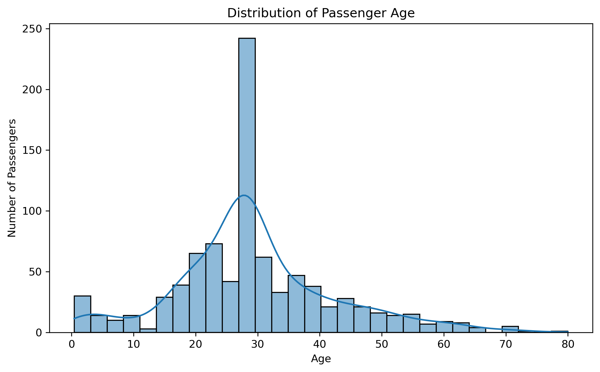

### 2. Fare Distribution

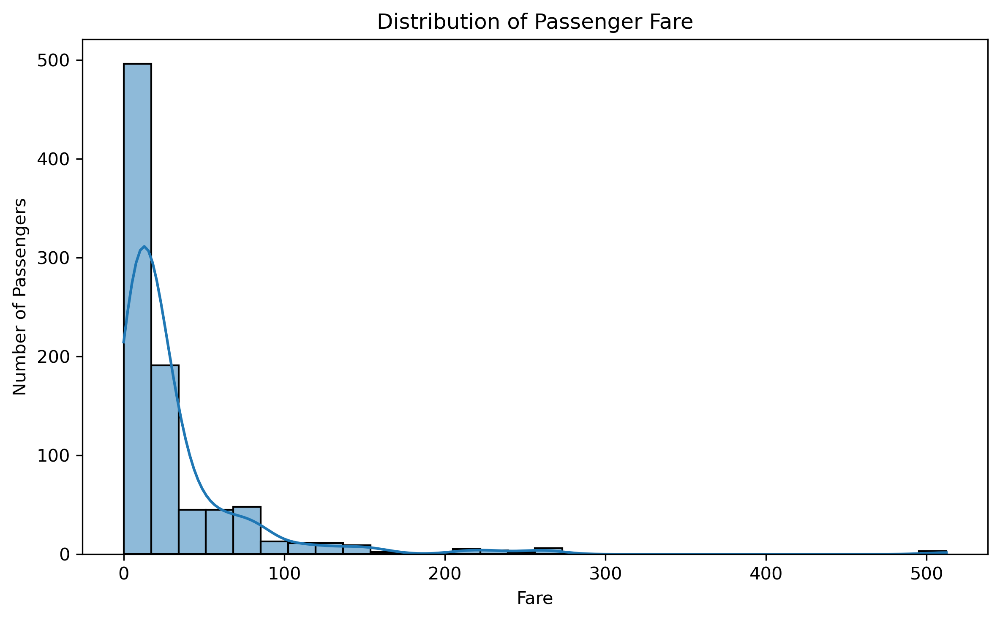

### 3. Passengers by Class

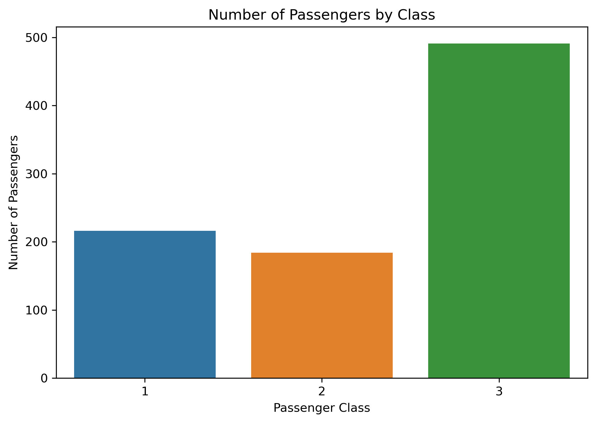

### 4. Age Boxplot

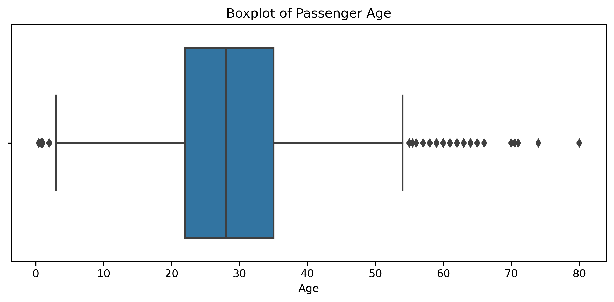

### 5. Fare Boxplot

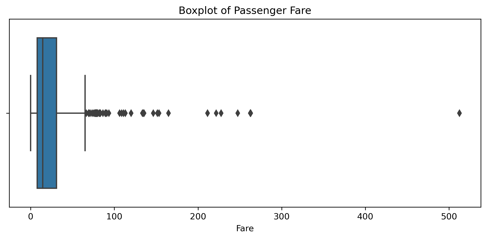

### 6. Survival Rate by Sex

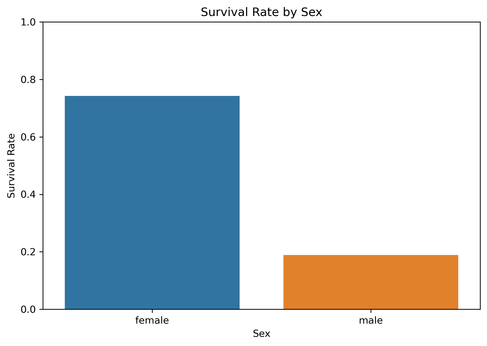

### 7. Survival Rate by Passenger Class

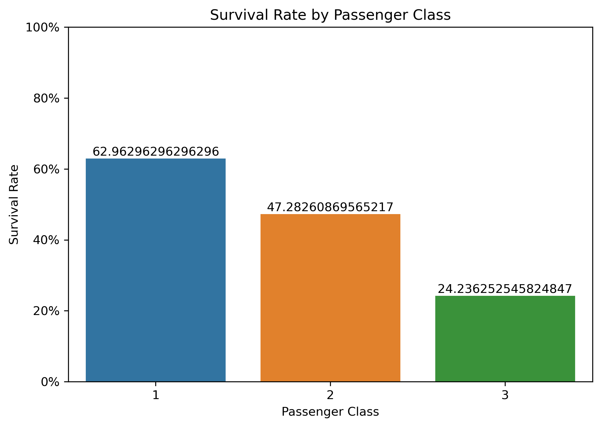

### 8. Survival Rate by Family Size

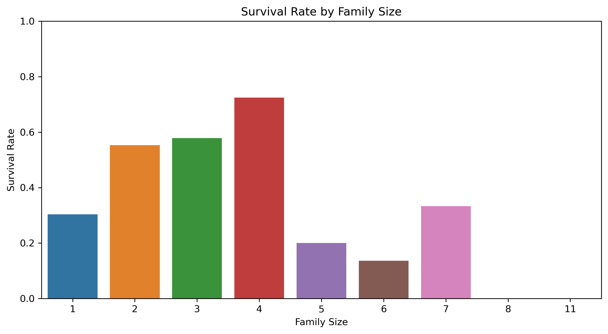

### 9. Correlation Heatmap

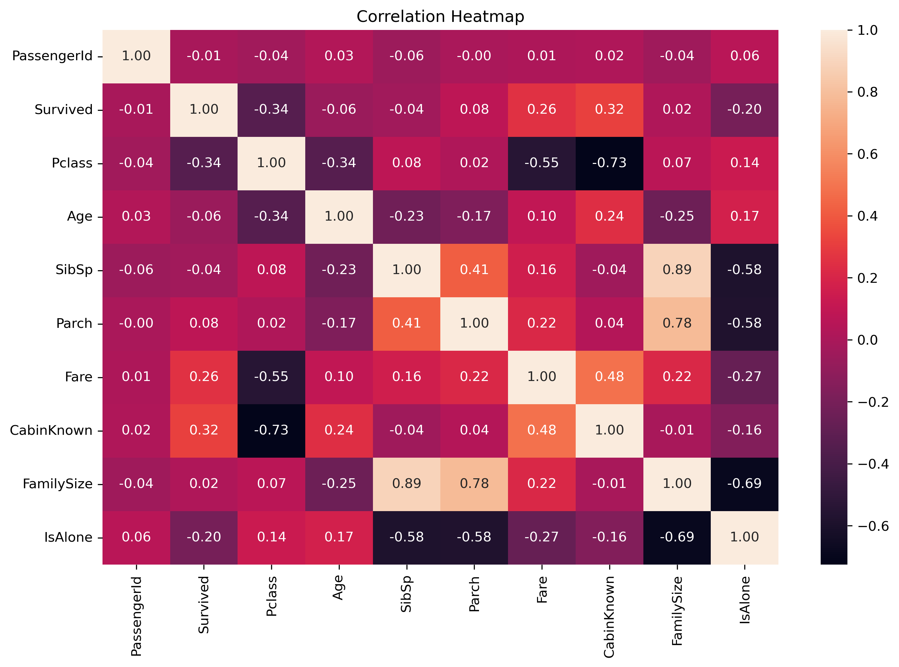

### 10. Survival Rate by Sex and Class

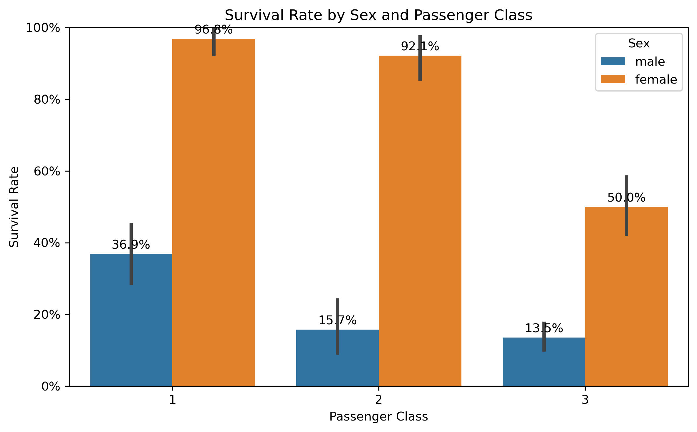

### 11. Calibration Check

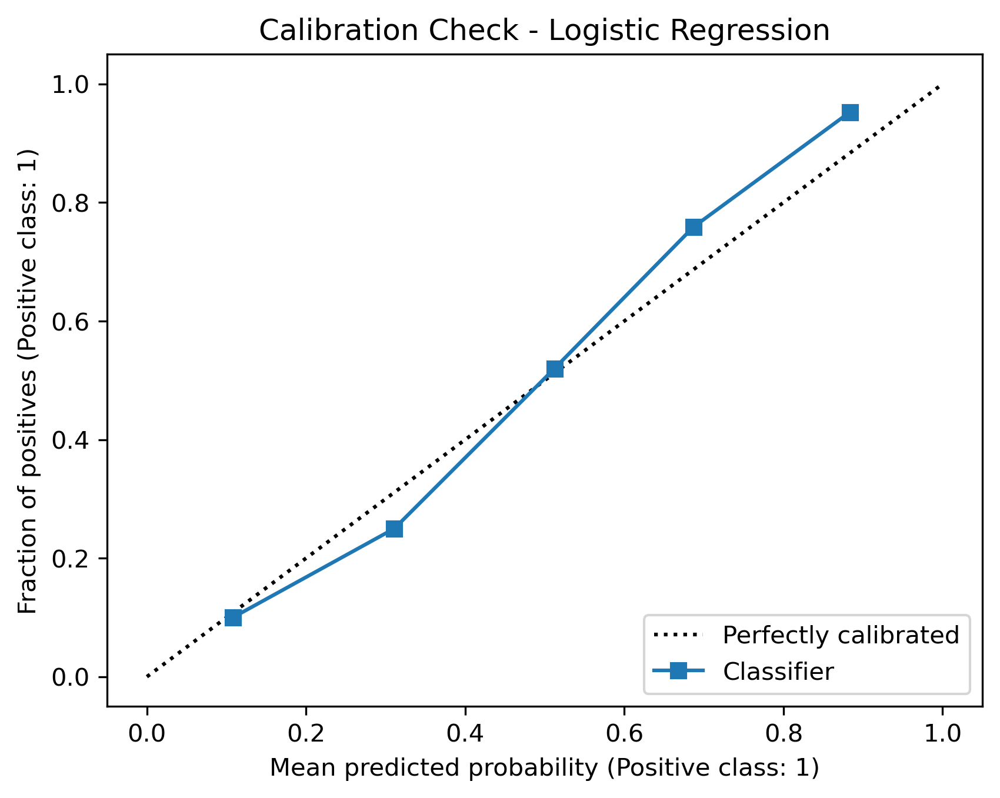

### 12. Permutation Importance

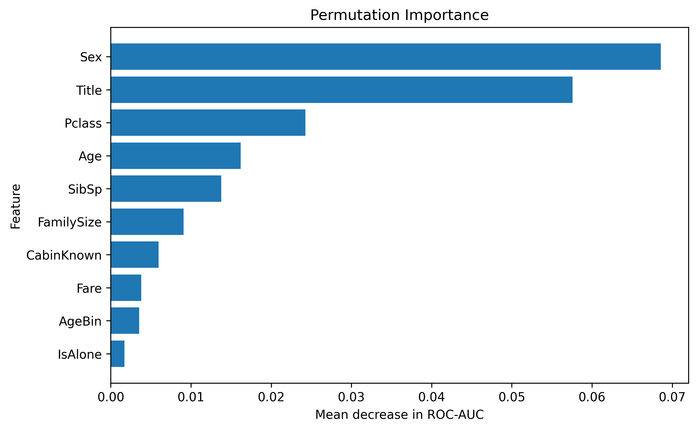

### 13. SHAP Feature Importance

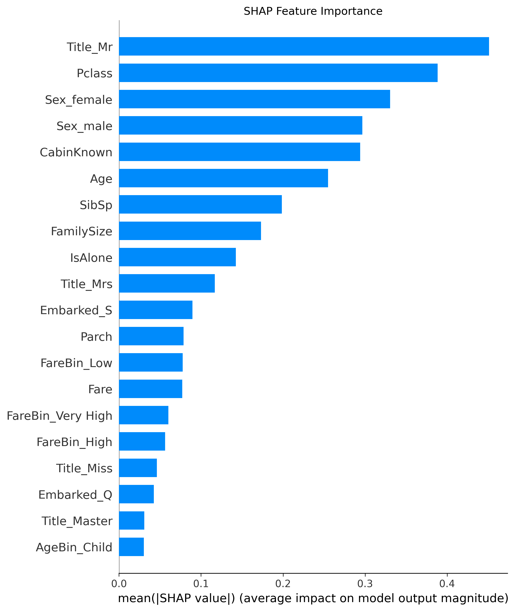

### 14. SHAP Summary

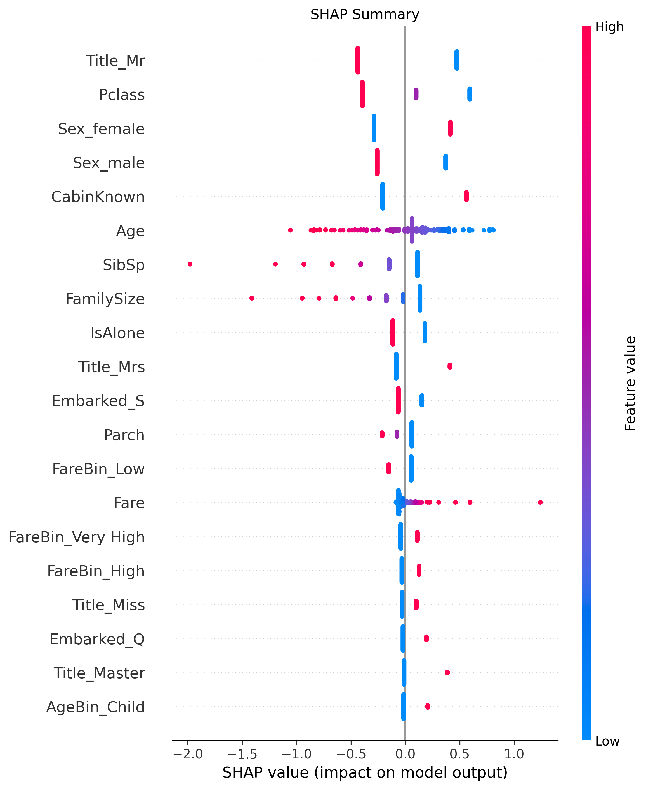

## Notebooks

### Titanic_EDA.ipynb

The EDA notebook covers the initial data checks, cleaning, feature engineering, visualizations, and analysis of the main survival patterns.

### Titanic_ML.ipynb

The ML notebook covers feature engineering, leakage-free preprocessing, cross-validation, model comparison, hyperparameter tuning, calibration, permutation importance, SHAP analysis, the model card, and saving the final model.

## Getting Started

The project uses Python and the following libraries:

```bash
pip install pandas numpy matplotlib seaborn scikit-learn shap joblib jupyter
```

Jupyter Notebook can then be started with:

```bash
jupyter notebook
```

The notebooks should be run from top to bottom.

## Tech Stack

- Python
- Pandas
- NumPy
- Matplotlib
- Seaborn
- Scikit-learn
- SHAP
- Jupyter Notebook
- Git & GitHub

## Project Structure

```text
titanic-survival-analysis/
│
├── data/
│   ├── train.csv
│   ├── test.csv
│   └── titanic_cleaned.csv
│
├── images/
│   ├── 01_age_distribution.png
│   ├── 02_fare_distribution.png
│   ├── 03_passengers_by_class.png
│   ├── 04_age_boxplot.png
│   ├── 05_fare_boxplot.png
│   ├── 06_survival_by_sex.png
│   ├── 07_survival_by_class.png
│   ├── 08_survival_by_family_size.png
│   ├── 09_correlation_heatmap.png
│   ├── 10_survival_by_sex_and_class.png
│   ├── 11_calibration_check.png
│   ├── 12_permutation_importance.png
│   ├── 13_shap_feature_importance.png
│   └── 14_shap_summary.png
│
├── artifacts/
│   └── titanic_survival_model.joblib
│
├── Titanic_EDA.ipynb
├── Titanic_ML.ipynb
├── SUMMARY.md
└── README.md
```

## Results

The EDA shows clear differences in survival by sex and passenger class. Fare and travelling alone also show useful relationships with survival, while age has a much weaker linear relationship.

The ML stage compares Logistic Regression, Random Forest, and Gradient Boosting using 5-fold stratified cross-validation. The models are then tuned with GridSearchCV and checked using accuracy, ROC-AUC, and F1.

Logistic Regression was selected as the final model. On the held-out validation set it achieved:

- Accuracy: 0.8156
- ROC-AUC: 0.8625
- F1: 0.7519

After calibration, the Brier Score was 0.1365 & ROC-AUC at 0.8622.

The final model was also checked using permutation importance and SHAP. The main interpretation results are saved as images in the `images` folder.

The trained calibrated pipeline is saved as `artifacts/titanic_survival_model.joblib`.

## Author

**Francis Parwez**

This project was completed as part of a Data Science & Analytics internship.
